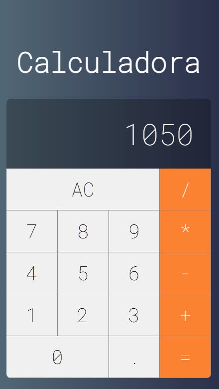

# 🧮 React Calculator

Uma calculadora moderna desenvolvida com React, com foco em componentização e lógica de operações.

## 🚀 Deploy

🔗 https://react-calculator-celio.vercel.app/

## 📸 Preview



## 🛠️ Tecnologias

* React
* JavaScript
* CSS

## ⚙️ Funcionalidades

* Soma, subtração, multiplicação e divisão
* Botão AC
* Interface estilo calculadora real

## ▶️ Rodar o projeto

```bash
git clone https://github.com/seu-usuario/react-calculator.git
cd react-calculator
npm install
npm start
```

## 👨‍💻 Autor

Celio Carneiro 🚀
